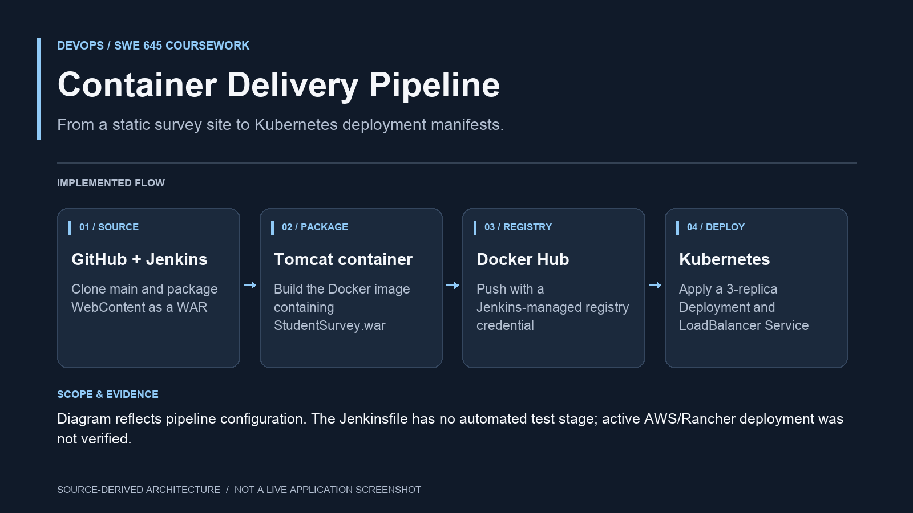

# Container Delivery Pipeline

Configured a Jenkins delivery pipeline that checks out a static student-survey site, packages a WAR, builds a Tomcat Docker image, pushes it to Docker Hub and applies Kubernetes manifests. The deployment declares three replicas and a LoadBalancer service. Source includes Docker, Jenkins and Kubernetes configuration plus coursework setup guides. The current Jenkinsfile does not contain an automated test stage, and this portfolio update does not verify an active AWS/Rancher deployment.

[Read the source map and scope](docs/PORTFOLIO.md).

## Source and configuration

- [Jenkinsfile](Jenkinsfile): clone, WAR packaging, image build, registry push and Kubernetes apply.
- [Dockerfile](Dockerfile): Tomcat 9 / Java 11 runtime for the WAR.
- [deployment.yaml](deployment.yaml): three replicas using `mfardeenshaik/swe645-hw2:latest`.
- [service.yaml](service.yaml): LoadBalancer service from port 80 to the container's port 8080.
- [Setup guide](HW2-SETUP-GUIDE.md): coursework environment instructions.

The pipeline expects `jar`, Docker and `kubectl` on the Jenkins agent, a Jenkins credential named `dockerhub-creds`, and cluster access configured separately. It does not contain an automated test stage or establish that a live cluster is currently serving the application. Historical endpoints in coursework notes were not verified during this documentation update.

The earlier [645-hw2](https://github.com/smfardeen7/645-hw2) repository contains an overlapping coursework iteration.
